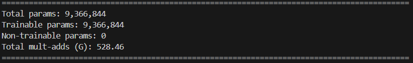
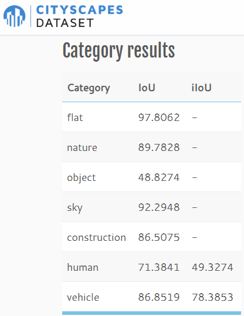

# FCN
PyTorch implementation of FCN8s.

Comment: Used pretrained VGG11 with Batch Normalization from torchvision as backbone.

Download trained model weights from [here](https://drive.google.com/drive/folders/1ZR9svn9aiiVfMIOQ8kJ_ohvcQplOk4qK?usp=sharing).

## Generating Masks from Annotations :
- Download "gtFine_trainvaltest.zip" and "leftImg8bit_trainvaltest.zip" from the [official cityscapes website](https://www.cityscapes-dataset.com/downloads/) and extract them in [data/](./data/).
- Run [generate_gt.py](./cityscapes/generate_gt.py), it will generate masks (trainId mask, labelId mask, color mask) as per the conventions of CityScapes Dataset and save them in appropriate directory.
- Comparing the generated mask with provided masks:


## Dataset
Make sure the project folder looks like this:
```
Project/
├── cityscapes/
│   └── ... (python scripts for data loader and utils)
├── data/
│   ├── generated_gt
│   ├── leftImg8bit
│   ├── gtFine
│   └── ... (other files from dataset)
├── fcn/
│   └── ... (python scripts for FCN8s model and utils)
├── outputs/
│   └── ... (output directory)
├── saved/
│   └── ... (save directory during training)
├── save_predictions.ipynb
├── test_fcn.py
├── train_fcn.py
├── visualize_training.ipynb
└── ... (other files from project)
```


## Training
- Run the following command to train FCN8s model:
```
python train_fcn.py
```

- Training Metrics:
<table style="width: 100%;">
  <tr>
    <td></td>
    <td></td>
  </tr>
  <tr>
    <td></td>
    <td></td>
  </tr>
  <tr>
    <td></td>
    <td></td>
  </tr>
</table>

Comment: The above plots are generated using [visualize_training.ipynb](visualize_training.ipynb)


## Performance
- Run the following command to evaluate FCN8s model on test sets:
```
python test_fcn.py --model_weights_path "./saved/{file_name}.pth"
```
- FCN8s Model evaluation on test set from official evaluation server:

<table style="width: 100%;">
  <tr>
    <td></td>
    <td rowspan="2"></td>
  </tr>
  <tr>
    <td></td>
  </tr>
</table>

Comment: The code saves all the predictions in the directory [outputs/fcn/](./outputs/) which can be zipped and uploaded to the official evaluation server to get the model performance evaluated.


## Predictions 
- FCN8s Model Predictions on CityScapes val: 


## Model Details
- Memory Requirements of FCN8s Model:

- Average Inference time of FCN8s Model:


Comment:
- FCN8s Model (pid=3983956) requires 1.9 GB VRAM for inference on complete image of size 1024 x 2048.
- FCN8s Model takes about 0.11 seconds for inference on complete image of size 1024 x 2048.
